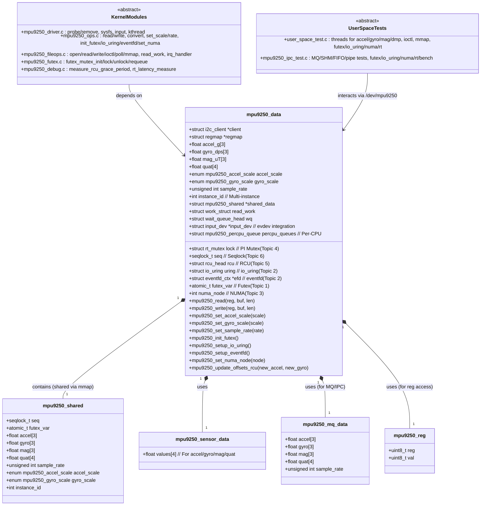
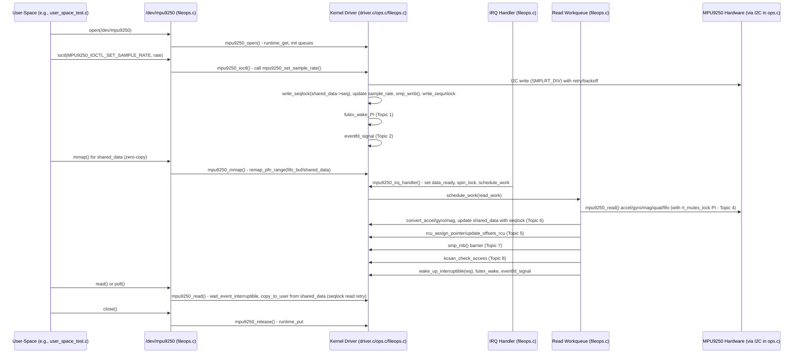

## mpu9250-kernel-advance

# UML Class Diagram
```
classDiagram
    class mpu9250_data {
        +struct i2c_client *client
        +struct regmap *regmap
        +struct rt_mutex lock  // PI Mutex (Topic 4)
        +seqlock_t seq  // Seqlock (Topic 6)
        +struct rcu_head rcu  // RCU (Topic 5)
        +struct io_uring uring  // io_uring (Topic 2)
        +struct eventfd_ctx *efd  // eventfd (Topic 2)
        +atomic_t futex_var  // Futex (Topic 1)
        +int numa_node  // NUMA (Topic 3)
        +float accel_g[3]
        +float gyro_dps[3]
        +float mag_uT[3]
        +float quat[4]
        +enum mpu9250_accel_scale accel_scale
        +enum mpu9250_gyro_scale gyro_scale
        +unsigned int sample_rate
        +int instance_id  // Multi-instance
        +struct mpu9250_shared *shared_data
        +struct work_struct read_work
        +struct wait_queue_head wq
        +struct input_dev *input_dev  // evdev integration
        +struct mpu9250_percpu_queue percpu_queues  // Per-CPU
        +mpu9250_read(reg, buf, len)
        +mpu9250_write(reg, buf, len)
        +mpu9250_set_accel_scale(scale)
        +mpu9250_set_gyro_scale(scale)
        +mpu9250_set_sample_rate(rate)
        +mpu9250_init_futex()
        +mpu9250_setup_io_uring()
        +mpu9250_setup_eventfd()
        +mpu9250_set_numa_node(node)
        +mpu9250_update_offsets_rcu(new_accel, new_gyro)
    }

    class mpu9250_shared {
        +seqlock_t seq
        +atomic_t futex_var
        +float accel[3]
        +float gyro[3]
        +float mag[3]
        +float quat[4]
        +unsigned int sample_rate
        +enum mpu9250_accel_scale accel_scale
        +enum mpu9250_gyro_scale gyro_scale
        +int instance_id
    }

    class mpu9250_sensor_data {
        +float values[4]  // For accel/gyro/mag/quat
    }

    class mpu9250_mq_data {
        +float accel[3]
        +float gyro[3]
        +float mag[3]
        +float quat[4]
        +unsigned int sample_rate
    }

    class mpu9250_reg {
        +uint8_t reg
        +uint8_t val
    }

    mpu9250_data "1" *-- "1" mpu9250_shared : contains (shared via mmap)
    mpu9250_data "1" *-- "1" mpu9250_sensor_data : uses
    mpu9250_data "1" *-- "1" mpu9250_mq_data : uses (for MQ/IPC)
    mpu9250_data "1" *-- "1" mpu9250_reg : uses (for reg access)

    class KernelModules {
        <<abstract>>
        +mpu9250_driver.c : probe/remove, sysfs, input, kthread
        +mpu9250_ops.c : read/write, convert, set_scale/rate, init_futex/io_uring/eventfd/set_numa
        +mpu9250_fileops.c : open/read/write/ioctl/poll/mmap, read_work, irq_handler
        +mpu9250_futex.c : futex_mutex_init/lock/unlock/requeue
        +mpu9250_debug.c : measure_rcu_grace_period, rt_latency_measure
    }

    class UserSpaceTests {
        <<abstract>>
        +user_space_test.c : threads for accel/gyro/mag/dmp, ioctl, mmap, futex/io_uring/numa/rt
        +mpu9250_ipc_test.c : MQ/SHM/FIFO/pipe tests, futex/io_uring/numa/rt/bench
    }

    KernelModules --> mpu9250_data : depends on
    UserSpaceTests --> mpu9250_data : interacts via /dev/mpu9250
```

### UML Class Diagram


# UML Sequence Diagram
```
sequenceDiagram
    participant User as User-Space (e.g., user_space_test.c)
    participant Dev as /dev/mpu9250 (fileops.c)
    participant Driver as Kernel Driver (driver.c/ops.c/fileops.c)
    participant IRQ as IRQ Handler (fileops.c)
    participant Work as Read Workqueue (fileops.c)
    participant Sensor as MPU9250 Hardware (via I2C in ops.c)

    User->>Dev: open(/dev/mpu9250)
    Dev->>Driver: mpu9250_open() - runtime_get, init queues
    User->>Dev: ioctl(MPU9250_IOCTL_SET_SAMPLE_RATE, rate)
    Dev->>Driver: mpu9250_ioctl() - call mpu9250_set_sample_rate()
    Driver->>Sensor: I2C write (SMPLRT_DIV) with retry/backoff
    Driver->>Driver: write_seqlock(shared_data->seq), update sample_rate, smp_wmb(), write_sequnlock
    Driver->>Driver: futex_wake_PI (Topic 1)
    Driver->>Driver: eventfd_signal (Topic 2)
    User->>Dev: mmap() for shared_data (zero-copy)
    Dev->>Driver: mpu9250_mmap() - remap_pfn_range(fifo_buf/shared_data)
    IRQ->>Driver: mpu9250_irq_handler() - set data_ready, spin_lock, schedule_work
    Driver->>Work: schedule_work(read_work)
    Work->>Sensor: mpu9250_read() accel/gyro/mag/quat/fifo (with rt_mutex_lock PI - Topic 4)
    Work->>Driver: convert_accel/gyro/mag, update shared_data with seqlock (Topic 6)
    Work->>Driver: rcu_assign_pointer/update_offsets_rcu (Topic 5)
    Work->>Driver: smp_mb() barrier (Topic 7)
    Work->>Driver: kcsan_check_access (Topic 8)
    Work->>Driver: wake_up_interruptible(wq), futex_wake, eventfd_signal
    User->>Dev: read() or poll()
    Dev->>Driver: mpu9250_read() - wait_event_interruptible, copy_to_user from shared_data (seqlock read retry)
    User->>Dev: close()
    Dev->>Driver: mpu9250_release() - runtime_put
```


# Architecture Flow Diagram
```
flowchart TD
    subgraph Hardware
        MPU9250[MPU9250 Sensor] -->|I2C Read/Write| I2C[I2C Bus]
        I2C -->|IRQ| GPIO[GPIO IRQ Pin]
    end

    subgraph KernelSpace
        Driver[mpu9250_driver.c: Probe/Remove, Sysfs, Input evdev, Kthread] -->|Init| Ops[mpu9250_ops.c: Read/Write, Convert, Set Scale/Rate, Calibration]
        Ops -->|Shared Data Update| Concurrency[Concurrency Primitives: Futex (futex.c), io_uring/eventfd, NUMA, PI Mutex, RCU, Seqlock, Barriers, Lockdep/KCSAN (debug.c)]
        Driver -->|IRQ Handling| IRQHandler[mpu9250_fileops.c: IRQ Handler, Read Workqueue]
        IRQHandler -->|Schedule Work| Workqueue[Read Work: Update Data, Wake/Futex/Eventfd]
        Workqueue -->|File Ops| FileOps[mpu9250_fileops.c: Open/Read/Write/Ioctl/Poll/Mmap]
        FileOps -->|mmap zero-copy| Shared[Shared Memory: mpu9250_shared (seqlock, futex_var)]
        Driver -->|Device Tree| DTS[mpu9250.dts: I2C Config, IRQ, Overrides]
    end

    subgraph UserSpace
        UserTest[user_space_test.c: Threads, Ioctl, Mmap, Futex/io_uring/numa/rt] -->|/dev/mpu9250| FileOps
        IPCTest[mpu9250_ipc_test.c: MQ/SHM/FIFO/Pipe, Bench, Futex/io_uring/numa/rt] -->|/dev/mpu9250| FileOps
        UserTest -->|liburcu/liburing/TSan| Concurrency
        IPCTest -->|liburcu/liburing/TSan| Concurrency
    end

    subgraph Build
        Makefile[Makefile: Build Module/Tests, Install, DTBO, Docs, Bench/Calib]
    end

    Hardware --> KernelSpace
    KernelSpace --> UserSpace
    Makefile --> KernelSpace
    Makefile --> UserSpace

    style Concurrency fill:#f9f,stroke:#333,stroke-width:2px
```

```mermaid
flowchart TD
    subgraph Hardware
        MPU9250[MPU9250 Sensor] -->|I2C Read/Write| I2C[I2C Bus]
        I2C -->|IRQ| GPIO[GPIO IRQ Pin]
    end

    subgraph KernelSpace
        Driver[mpu9250_driver.c: Probe/Remove, Sysfs, Input evdev, Kthread] -->|Init| Ops[mpu9250_ops.c: Read/Write, Convert, Set Scale/Rate, Calibration]
        Ops -->|Shared Data Update| Concurrency[Concurrency Primitives: Futex (futex.c), io_uring/eventfd, NUMA, PI Mutex, RCU, Seqlock, Barriers, Lockdep/KCSAN (debug.c)]
        Driver -->|IRQ Handling| IRQHandler[mpu9250_fileops.c: IRQ Handler, Read Workqueue]
        IRQHandler -->|Schedule Work| Workqueue[Read Work: Update Data, Wake/Futex/Eventfd]
        Workqueue -->|File Ops| FileOps[mpu9250_fileops.c: Open/Read/Write/Ioctl/Poll/Mmap]
        FileOps -->|mmap zero-copy| Shared[Shared Memory: mpu9250_shared (seqlock, futex_var)]
        Driver -->|Device Tree| DTS[mpu9250.dts: I2C Config, IRQ, Overrides]
    end

    subgraph UserSpace
        UserTest[user_space_test.c: Threads, Ioctl, Mmap, Futex/io_uring/numa/rt] -->|/dev/mpu9250| FileOps
        IPCTest[mpu9250_ipc_test.c: MQ/SHM/FIFO/Pipe, Bench, Futex/io_uring/numa/rt] -->|/dev/mpu9250| FileOps
        UserTest -->|liburcu/liburing/TSan| Concurrency
        IPCTest -->|liburcu/liburing/TSan| Concurrency
    end

    subgraph Build
        Makefile[Makefile: Build Module/Tests, Install, DTBO, Docs, Bench/Calib]
    end

    Hardware --> KernelSpace
    KernelSpace --> UserSpace
    Makefile --> KernelSpace
    Makefile --> UserSpace

    style Concurrency fill:#f9f,stroke:#333,stroke-width:2px
```
